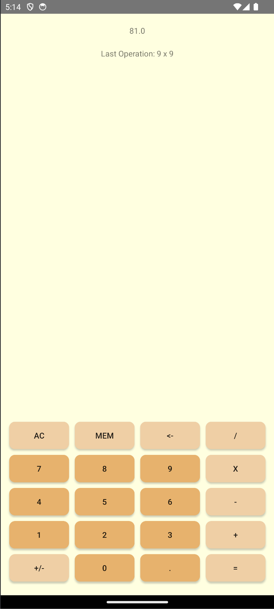

# Simple Calculator
### This is a simple calculator app I wrote in Java using Android Studio

## Built With
- Android Studio
- Java

## Features
- Perform +, -, *, /
- Calculates correct value with any number of input operations
- Allows for changing sign of current number entered
- stores values as double, if value has no decimal converts it to an integer representation to remove ".0" from the double

## Installation
- Download Android Studio https://developer.android.com/studio
- Open project in Android Studio
- Run Application

## Screenshot

## Contact
Kirill Toptun - kirilltoptun@gmail.com